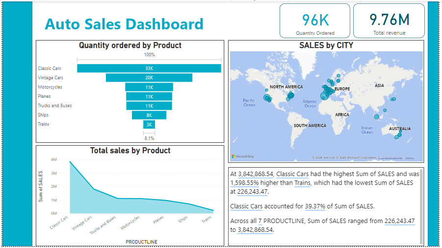
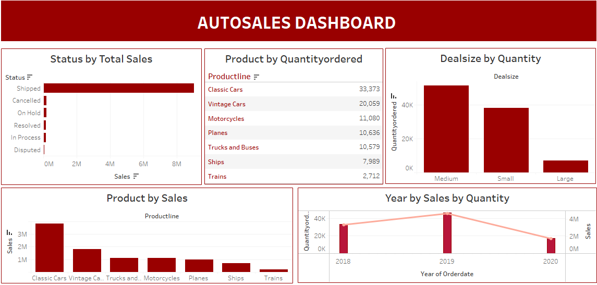
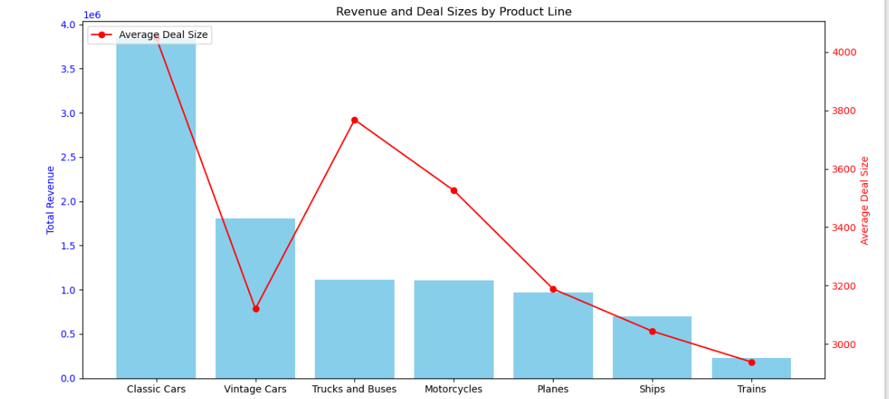
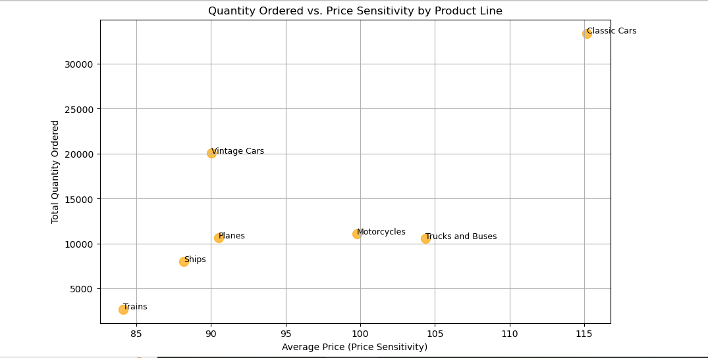
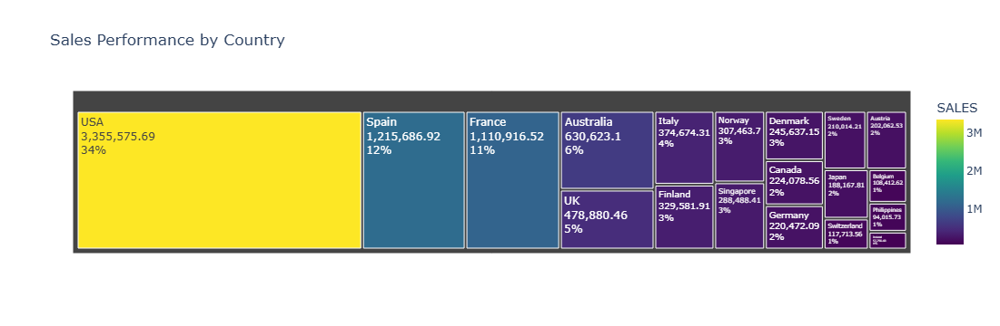
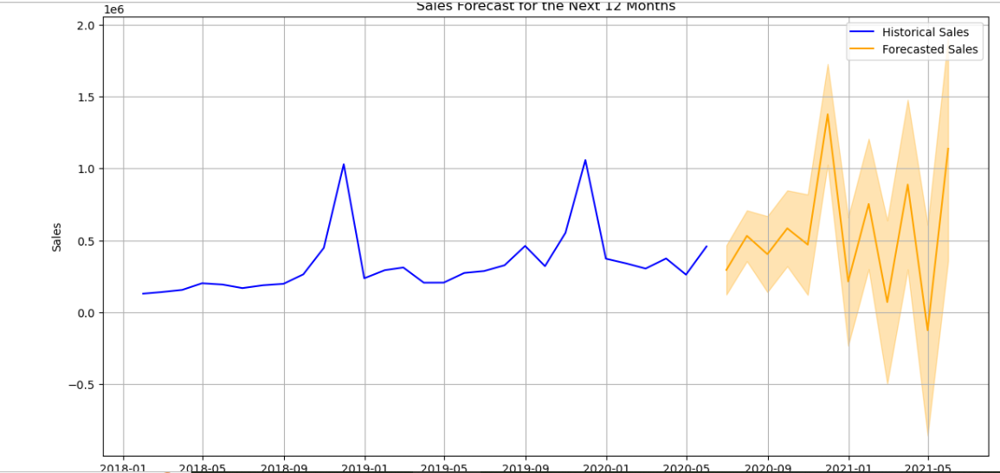

# Auto_sales_analysis 🚗🚋🚌💹
This project is an analysis of an Auto company sales analysis, segmentation and sales forecast. 

## Inroduction

Effective sales analysis is a cornerstone of business success, providing critical insights into customer behavior, product performance, and market trends. This project focuses on a comprehensive sales data analysis of an auto company aimed at uncovering actionable insights to drive strategic decision-making.

## Problem Statement
1. Which product lines generate the highest sales revenue, and what is the contribution of each product line?
2. Who are the top customers contributing the most to revenue, and how can their patterns be leveraged?
3. What is the relationship between deal size, product category, and revenue generation?
4. How do sales differ across regions, and which cities or countries drive higher sales performance?
5. What will the total sales be for the next 12 months, and how can historical trends guide predictions?
6. Which order statuses contribute the most to sales revenue, and how can order management be optimized?
7. What geographic regions or cities contribute the most to sales revenue, and how can regional sales strategies be refined?

## Data 📑
The data contains the following columns:
- ORDERNUMBER
- QUANTITYORDERED
- PRICEEACH
- ORDERLINENUMBER
- SALES
- ORDERDATE
- DAYS_SINCE_LASTORDER
- STATUS
- PRODUCTLINE
- PRODUCTCODE
- CUSTOMERNAME
- PHONE
- CITY
- COUNTRY

*You can access the dataset* [here](https://github.com/kouatcheu1/Auto_sales_analysis/blob/main/Auto_Sales_data.csv)

## Skills demonstrated :
- Data Collection and Preparation using SQL
- Exploratory Data Analysis (EDA) using SQL
- Sales Segmentation using Python
- Forecast Analysis using Python
- Interactive Dashboard Creation using Power BI and Tableau

## Visualization 📊

Data visualization was created using power bi and Tableau using different charts to highlight hidden insights from the data.

# Power BI Dashboard

**Features**:
- **Quantity Ordered by Product (Horizontal Bar Chart)**
- *Insights:*
1. Classic Cars have the highest quantity ordered, with 33K units sold, dominating all other product lines.
2. Vintage Cars follow with 20K units, while Trains have the lowest quantity ordered, at only 3K units.

- **Total Sales by Product (Area Chart)**
- *Insights:*
1. Classic Cars generate the highest revenue, contributing 3.84M to total sales.
2. The revenue significantly declines for other product lines, with Trains generating the lowest at 226K.

- **Sales by City (Map Visualization)**
- *Insights:*
1. The map shows sales performance geographically, with sales spread across North America, Europe, Asia, and Australia.
2. North America and Europe seem to have the most sales activity (denser clusters), while other regions like Africa have minimal activity.
  
- **Key Metrics (Cards at the Top)**
1. Quantity Ordered: 96K units sold across all product lines.
2. Total Revenue: 9.76M in sales.
- *Insights:The high total revenue highlights a strong overall sales performance, with Classic Cars contributing a significant share of this total.*

- **Text Summary (Bottom Right)**
- *Highlights:*
1. Classic Cars account for 39.37% of total sales, making it the leading contributor to revenue.
2. Sales range widely across product lines, from 226K (Trains) to 3.84M (Classic Cars).

_You can interact with the Power BI dashboard_ [here](https://app.powerbi.com/view?r=eyJrIjoiMWQ2ZmU5OTYtOTVkNi00NjRiLWJhOWUtMTE1YjNlOTZiNWNkIiwidCI6ImJmZTU4MzM2LWNhYjktNGRlNS1iYTc1LThjZmY3ZTIyZWMyYyIsImMiOjN9)

# Tableau Dashboard

**Features**:
- **Status by Total Sales (Bar Chart)**
- *Insights:*
1. The majority of the sales revenue comes from orders with the status "Shipped" (around 8 million).
2. Other statuses like "Cancelled," "On Hold," "Resolved," "In Process," and "Disputed" contribute negligible amounts, indicating most sales proceed without major issues.

- **Product by Quantity Ordered (Tabular Summary)** 
- *Insights:*
1. Classic Cars dominate the number of units sold, with 33,373 units, followed by Vintage Cars (20,059) and Motorcycles (11,080).
2. Trains are the least sold category with just 2,712 units, showing significantly low demand.
   
- **Deal Size by Quantity (Bar Chart)**
- *Insights:*
1. Medium-sized deals generate the highest quantity of orders, followed by small-sized deals.
2. Large deals contribute the least, with negligible order quantities.

- **Product by Sales (Bar Chart)**
- *Insights:*
1. Classic Cars generate the highest sales revenue, exceeding 3 million, followed by Vintage Cars and Trucks and Buses.
2. Categories like Ships, Trains, and Planes show the lowest sales performance.

- **Year by Sales by Quantity (Combo Chart (Bar + Line))**
- Insights:
1. Sales by quantity peaked in 2019 (over 40,000 units), with both revenue and quantity significantly higher than 2018 and 2020.
2. There is a noticeable decline in 2020, likely due to external factors like market conditions or supply chain issues.

*You can access the tableau file* [here](https://github.com/kouatcheu1/Auto_sales_analysis/blob/main/Tableau_Dashboard.twb)

## Analysis 📉📈

  
# Exploratory Data Analysis (EDA) was performed using SQL; and the following questions were answered:
1.	What are the top-selling product lines, and how much revenue do they generate?
- Ans: Top 5 selling products are (Classic cars, Vintage cars, Bus and trucks, Motorcycles, Planes) with values of ('3248229.139', '1510284.260', '955157.540', '952185.410', '788540.92') respectively. 

2.	Which countries or cities contribute the most to total sales?
- Ans: Among 54 present cities, MADRID contributed the most to the total sales while Munich had lowest sales.

3.	What are the monthly or yearly sales trends?
- Ans: Monthly sales trend (November 2018 had the highest sales followed by November 2019).

4.	Who are the top customers contributing the most to revenue?
- Ans: The top 5 contributing the most to total revenue are ('Euro Shopping Channel', 'Mini Gifts Distributors Ltd.', 'Australian Collectors, Co.', 'Muscle Machine Inc', 'La Rochelle Gifts').

5.	How does deal size (DEALSIZE) impact product line sales?
- Ans: From the report (DEALSIZE) with medium size contributed the most to the total revenue compared to the two other sizes (large and small). Also Classic cars that are medium had the highest sales contribution.

*You can access the SQL scripts file* [here](https://github.com/kouatcheu1/Auto_sales_analysis/blob/main/Auto_SQL_File.sql)

# Sales Segmentation was performed using Python; and the following were derived:
- Sales Trends by Product Categories: A bar chart to show the distribution of sales by product lines and a dual-axis chart showing total revenue and average deal sizes by product line.

- Segment Analysis: A scatter plot showing how quantity ordered relates to price sensitivity for product lines.

  
- Regional Performance: A treemap to visualize which regions (countries) are driving higher sales performance.

# Forecast Analysis was performed using Python; and the following questions were derived:
- What will be the total sales for the next 1 year?
- *Ans:*
1. Historical Sales (Blue Line):
o	The blue line represents the monthly sales trend over the past periods.
o	You can observe fluctuations in sales, with noticeable peaks and troughs, indicating some seasonality or periodic trends.

2.	Forecasted Sales (Orange Line):
o	The orange line shows the predicted sales for the next 12 months based on the SARIMA model.
o	The forecast continues the trend observed in the historical data, factoring in seasonality, trends, and patterns.

3.	Confidence Interval (Shaded Region):
o	The shaded area around the orange line represents the confidence interval (e.g., 95%).
o	It provides a range within which the actual sales values are likely to fall.
o	A wider confidence interval indicates greater uncertainty in the forecast.

- **Interpretation**:
*The forecast suggests a continuation of the historical trend. If sales were increasing over time, the forecast reflects this growth, and if they were fluctuating seasonally, it accounts for those patterns.*

## Summary

  
This analysis focused on sales performance across various dimensions, including product categories, regional trends, customer contributions, and forecast predictions. Key findings include:
1. **Top Performers**: Classic Cars dominate sales, contributing 39.37% of total revenue and leading in quantity ordered with 33,373 units.
2. **Regional Insights**: North America and Europe drive the majority of sales, with dense sales activity observed in cities like Madrid, while regions like Africa underperform.
3. **Customer Contributions**: Top customers, such as Euro Shopping Channel and Mini Gifts Distributors Ltd., significantly contribute to total revenue.
4. **Sales Trends**: November 2018 and November 2019 recorded the highest monthly sales, indicating seasonality.
5. **Order Management**: "Shipped" orders contribute overwhelmingly to revenue, while other order statuses like "Cancelled" and "On Hold" are negligible.
6. **Forecast Analysis**: Using SARIMA, sales for the next 12 months are projected to continue historical trends, with some seasonality and uncertainty reflected in confidence intervals.
7. **Underperforming Categories**: Trains and Ships contribute the least to both revenue and quantity ordered, with sales well below other product lines.

## Conclusion

The business demonstrates strong performance in specific areas, with Classic Cars leading both in revenue and sales volume. Regional sales data highlight a concentration in North America and Europe, presenting opportunities for growth in underperforming regions. Key customers play a significant role in revenue generation, showcasing the value of nurturing relationships with high-value clients. Historical data reveal seasonal patterns, providing a basis for targeted sales and inventory strategies. However, underperforming categories like Trains and Ships and regions such as Africa indicate areas requiring strategic interventions.

## Recommendations

1. Product Strategy:

Focus marketing, production, and inventory efforts on high-performing product lines, particularly Classic Cars.
Reassess strategies for underperforming categories (e.g., Trains and Ships) by evaluating market demand, pricing, and customer preferences.

2. Regional Sales Expansion:

Increase marketing and distribution efforts in underperforming regions like Africa while maintaining a strong presence in North America and Europe.
Leverage data-driven insights to tailor regional strategies based on consumer preferences.

3. Customer Relationship Management:

Enhance loyalty programs and personalized offers for top customers to ensure continued revenue contributions.
Target medium-tier customers with growth potential to diversify revenue sources.

4. Seasonal Sales Planning:

Align promotions, inventory stocking, and campaigns with peak sales months, such as November.
Anticipate and mitigate potential challenges in off-peak months using predictive analytics.

5. Order Management Optimization:

Streamline operations to maximize the number of "Shipped" orders, minimizing cancellations and delays.
Investigate reasons for "Cancelled" and "On Hold" statuses and implement measures to reduce their occurrence.

6. Forecasting and Planning:

Use the SARIMA forecast to plan inventory and resource allocation for the next 12 months, accounting for seasonal variations.
Monitor actual sales against forecasted data to refine predictive models for improved accuracy.

7. Dashboard Utilization:

Leverage interactive dashboards to enable real-time monitoring of sales performance, product trends, and regional insights.
Use visualizations like bar charts, treemaps, and combo charts to communicate findings and align team efforts effectively.

*By implementing these recommendations, the business can sustain growth, enhance performance in weak areas, and maximize profitability.* 💰🥰

